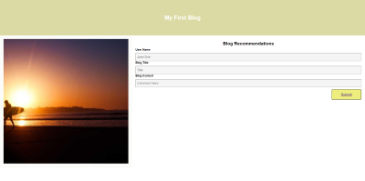

# my-blog

## Description

This project includes two pages; page(1) being the landing page of the blog and page(2) being the blog content. To get to the second page one should be able to fill out information and hit the submit button, which will take them to the second page. In this project we had to include a light and dark mode, and a working back button that will take you back to the previous page.

In this challange we had to make a local storage for any one that fills out information it will be stored in the DOM. In this challage we also had to urge the user, if not filling the person information out correctly they will be prompted to an alert. 
.

```md

```


# Links

[Live URL](https://github.com/meg-an321/my-blog)

[GitHub](https://meg-an321.github.io/my-blog/)